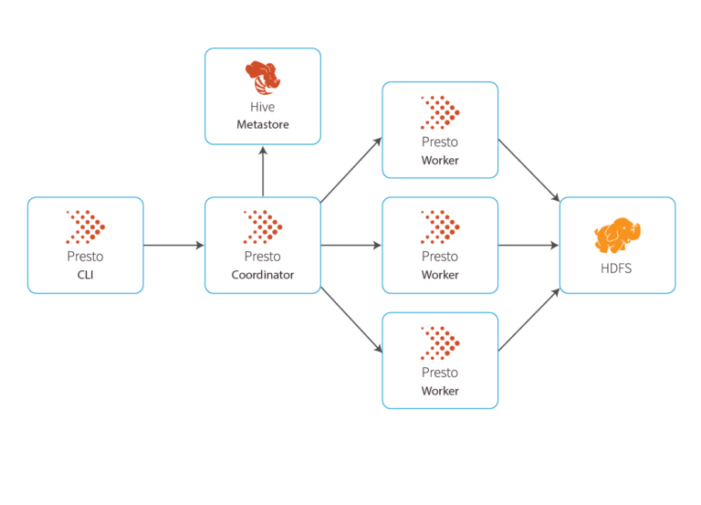

# Presto with Apache Ranger in Docker
docker-compose for development purposes.

## How to run
Building and pulling images. This will take several minutes.
```bash
docker-compose build
```
Then, just run:
```bash
docker-compose up -d
```

- Presto running at [http://localhost:8080](http://localhost:8080).
- Apache Ranger running at [http://localhost:6080](http://localhost:6080).
  - User is `admin` and password is `ranger1234`. The UI may take a while in order to start.
- Apache Solr running at [http://localhost:8983](http://localhost:8983).

## Presto
Presto is an open source distributed system that can run on multiple machines. Its distributed SQL query engine was built for fast analytic queries. A typical Presto deployment will include one Presto Coordinator and any number of Presto Workers.

**Presto Coordinator**: Used to submit queries and manages parsing, planning, and scheduling query execution across Presto Workers. The Presto Coordinator is truly the brain of any Presto installation and every installation requires it. It parses statements, plans queries, and manages Presto worker nodes, and it tracks all the Workers’ activity to coordinate queries. It gets results from the Workers and returns final results back to the client. Coordinators connect with workers and clients via REST.

**Presto Worker**: Processes the queries, adding more workers gives you faster query processing. The Presto Worker executes tasks and processes data. These nodes share data amongst each other and get data from the Coordinator. When you first start up a Presto Worker, it will be identified by the Coordinator and make itself available for task execution.

<p align="center">
    
</p>

### Presto Components

**Catalog**: Presto Catalogs contain the information about where data is located – they contain schemas and the data source. When users run a SQL statement in Presto, it means they’re running it against one or more catalogs. For example, you may build a Hive catalog to access Hive information from the Hive data source. Catalogs are defined in properties files stored in the Presto configuration directory. For example, the Hive connector maps each Hive database to a schema, so if the Hive connector is mounted as the hive catalog, and Hive contains a table clicks in database web, that table would be accessed in Presto as hive.web.clicks.

**Tables and schemas**: If you’re familiar with relational databases, it’s the same concept. A table is a set of unordered rows of data that can be organized into named columns/types. Schema is what you use to organize your tables. Catalogs and schemas are how users define what will be queried.

**Connector**: Connectors are used to integrate Presto with external data sources like object stores, relational databases, or Hive. You can integrate with these sources using standard APIs via Presto’s SPI implementation. Presto has over 20 built-in connectors for various data sources. Every Presto Catalog is associated with a specific connector, and more than one catalog can use the same connector to access different instances/clusters of the same data source.

**Statements and Queries**: Presto executes ANSI-compatible SQL statements. When a statement is executed, Presto creates a query along with a query plan that is then distributed across a series of Presto workers. When Presto parses a statement, it converts it into a query and creates a distributed query plan among Presto workers. A statement is simply passing along the instructions while the query is actually executing it.

**Stage**: To execute a query, Presto breaks it up into stages. Depending on how much data it needs to aggregate, there may be several stages that implement different sections of the query. Stages are typically done in a hierarchical manner (it may look like a tree). Every query has a “roots” stage which aggregates all the data from other stages. Keep in mind the stages themselves don’t run on Presto workers, they may run on the database underneath (this is called push-down).

**Task**: Stages (from above) are implemented as a series of tasks that may be distributed over a network of Presto workers. Tasks have inputs and outputs and are executed in parallel with a series of drivers.

**Split**: Splits are sections of larger data sets and how tasks operate. When Presto schedules a query, the Coordinator keeps track of which machines are running tasks and what splits are being processed by tasks.

**Drivers and Operators**: Tasks contain one or more parallel drivers and they are operators in memory. An operator consumes, transforms and produces data.

**Exchange**: Exchanges transfer data between Presto nodes for different stages of a query. Tasks produce data into an output buffer and consume data from other tasks using an exchange client.

### Presto CLI 
Example of commands:
```bash
presto> show catalogs;
presto> show schemas from jmx;
presto> show tables from jmx.current;
presto> select * from jmx.current."com.facebook.airlift.discovery.client:name=announcer";
```


### Apache Ranger Plugin
In order to generate the `ranger-<version>-presto-plugin.tar.gz` you must follow the instructions described on this [link](https://github.com/apache/ranger).
Basically, after compiling a docker image for Apache Ranger, just go to `/opt/apache-ranger-2.1.0/target`. There you'll find the all *.tar.gz files.

## Apache Ranger
Apache Ranger is a framework to enable, monitor and manage comprehensive data security across the Hadoop platform.

The vision with Ranger is to provide comprehensive security across the Apache Hadoop ecosystem. Enterprises can potentially run multiple workloads, in a multi tenant environment. Data security within Hadoop needs to evolve to support multiple use cases for data access, while also providing a framework for central administration of security policies and monitoring of user access.

Apache Ranger has the following goals:

- Centralized security administration to manage all security related tasks in a central UI or using REST APIs.
- Fine grained authorization to do a specific action and/or operation with Hadoop component/tool and managed through a central administration tool.
- Standardize authorization method across all Hadoop components.
- Enhanced support for different authorization methods - Role based access control, attribute based access control etc.
- Centralize auditing of user access and administrative actions (security related) within all the components of Hadoop.

**Ranger Admin Portal** - This is the UI portal and RESTful server for managing policies, users and groups. It also contains the UI interface for Audit queries and adhoc reports.

**Ranger UserSync** - This is a standalone server with dual purpose. It is used to synchronize the users/groups from Unix system or LDAP into RangerAdmin. This standalone process can be also used as an authentication server for RangerAdmin to use the linux user/password for login into RangerAdmin.

**Ranger KMS** - This service provides key management for Hadoop HDFS Encryption (TDE). It is highly scalable and provides access control and auditing. This service is optional and only needed if you are planning to use HDFS TDE.


### Requirements
> RDBMS - MySQL

- Storing policies
- Storing Ranger Users and Groups
- Storing Audit Logs (Optional)

> Solr

- Store Audit Logs
- Used by RangerAdmin Portal to search AuditLogs

### HDFS
Store Audit Logs (Optional, but recommended)

## Hue
An open source SQL Assistant for Databases & Data Warehouses i.e. an easy GUI for looking into HDFS, Hive etc. Very handy for beginners! It is maintained by Cloudera and you can find it on GitHub.

# Referencies
- [AN INTRODUCTION TO THE PRESTO ARCHITECTURE](https://www.alluxio.io/learn/presto/architecture/)
- [Presto Docs](https://prestodb.io/docs/current/overview/concepts.html)
- [Apache Ranger](https://cwiki.apache.org/confluence/display/RANGER/Index)
